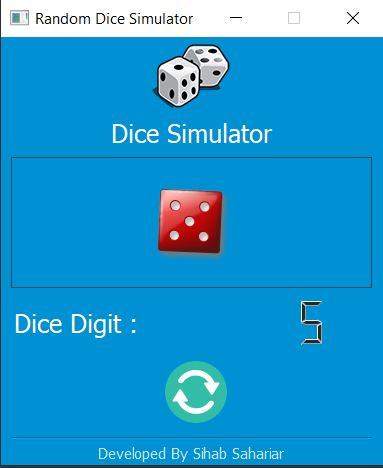

# GMAP PLOTTER
A basic random dice simulator developed in Python using PyQt5 framework.  

Information:
------------
- Programming Language: Python
- Framework: PyQt5

Screenshot
---------------

          

