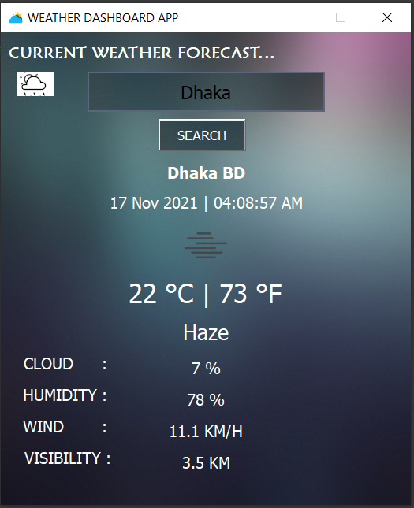

# Weather-Dashboard-PyQt5
🌤️This is a weather forecast dashboard application made with Python

# GUI
PyQt designer is used to make UI. 

# How to use
🌤️Enter city name in city field. 
🌤️Click on Search or hit Enter. 
🌤️If you write incorrect city name it will show error as "Enter another city name".
🌤️Whenever you open app, you will get to see a changed background every time.

#Screenshot

# API
Api used for fetching weather forecast Open Weathermap (https://openweathermap.org/)

